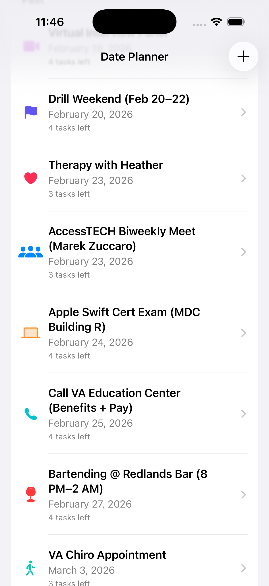
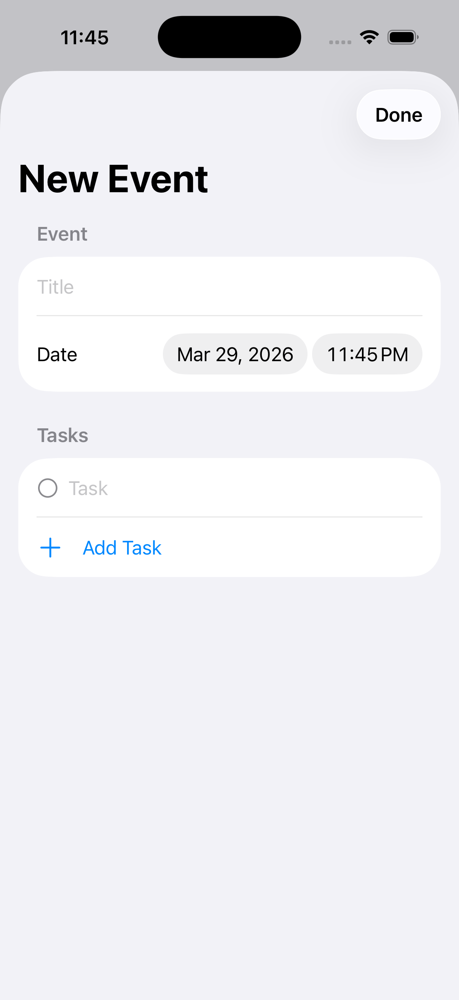
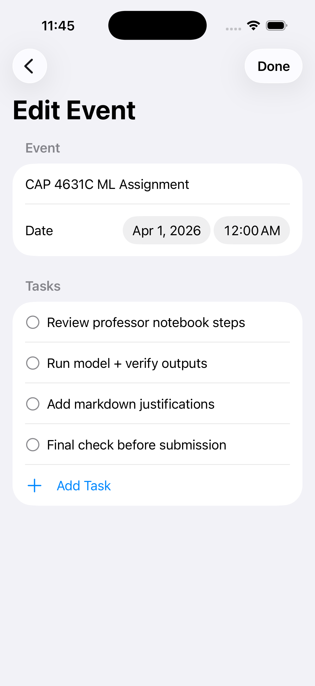

# iOS Date Planner

A SwiftUI event planning app designed to help users organize upcoming events, manage tasks, and keep track of deadlines in a clean, mobile-friendly interface.

## Overview

This project was built as part of my iOS development portfolio to demonstrate practical SwiftUI app structure, state-driven UI updates, and clean productivity-focused design. The app allows users to create events, edit existing entries, and organize event-related tasks in a simple and intuitive workflow.

## Features

- Create new events
- Edit existing events
- Add and manage task lists within each event
- Clean event overview grouped by time range
- Simple, focused SwiftUI interface
- Structured app flow for productivity and planning

## Built With

- Swift
- SwiftUI
- Xcode

## Screenshots

### Main Screen
Shows the main event list organized by upcoming date ranges.

### New Event
Allows the user to create a new event, assign a date and time, and add tasks.

### Edit Event
Lets the user update an existing event and manage its task list.

## What This Project Demonstrates

- SwiftUI layout design
- State management
- Form-based input handling
- Task and event organization
- Reusable view structure
- Clean mobile productivity UI

## Why I Built It

I wanted to create a practical iOS app that felt useful and realistic rather than purely decorative. This project helped me practice building a functional workflow-based app while strengthening my understanding of SwiftUI structure, data flow, and interface design.

## Status

Completed as a portfolio iOS project.

## Author

**Jessica Vargas** 
Data Analytics Student | App Developer
